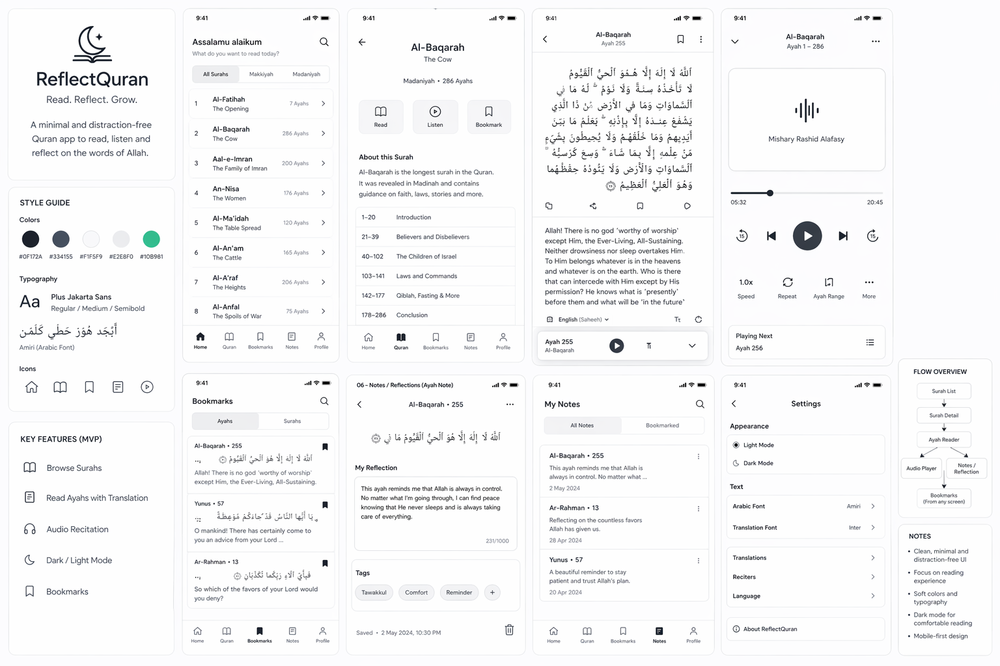

# ReflectQuran — Minimal Quran Reflection App

ReflectQuran is a clean, distraction-free Quran reading and reflection web app.
The goal is to build a **solid, usable foundation first**, then evolve it into a more intelligent, feature-rich experience over time.

This project is being developed **alongside learning React**, with a focus on real-world implementation rather than just theory.

---

## Current Focus

Right now the priority is:

- Build a **working MVP**
- Keep things **simple and functional**
- Avoid over-engineering
- Ship features **incrementally**

---

## Tech Stack

- **Frontend:** React (Vite)
- **Styling:** Tailwind CSS
- **State Management:** React (useState, useEffect → Context later)
- **Backend (later):** Firebase or Supabase

---

## Data Sources

- Quran.com API
- AlQuran Cloud API

**Used for:**

- Surah & Ayah data
- Translations
- Audio

---

## Development Phases

---

### 🧱 Phase 1 — Core MVP (Current)

**Goal:** Build a usable Quran reader

#### Surah List

- [x] Fetch and display all Surahs
- [x] Show basic info (name, translation, ayah count)

#### Surah Detail

- [ ] Display Ayahs
- [ ] Show Arabic text
- [ ] Show translation

#### Navigation

- [ ] Routing (Surah → Detail page)

---

### ⚙️ Phase 2 — Make it a Real App

**Goal:** Add usability features

- [ ] Audio playback (per Ayah)
- [ ] Dark mode
- [ ] Bookmarks (localStorage first)
- [ ] Basic UI polish

---

### 🧠 Phase 3 — Personal Layer

**Goal:** Add user interaction

- [ ] Notes per Ayah
- [ ] Save reflections (backend)
- [ ] Highlight Ayahs

---

### 🎧 Phase 4 — Audio + Voice (Future)

**Goal:** Enable recitation interaction

- [ ] Record user voice (Web Audio API)
- [ ] Playback + control system

---

### 🤖 Phase 5 — AI Features (Long-term)

**Goal:** Move toward Tarteel-like experience

- [ ] Speech-to-text (Whisper / similar)
- [ ] Compare recitation with actual Ayah
- [ ] Detect mistakes (basic matching)

---

## Project Structure (⚠️)
src/
├── components/
│ ├── Navbar.jsx
│ ├── SurahCard.jsx
│ ├── Ayah.jsx
│ └── AudioPlayer.jsx
│
├── pages/
│ ├── SurahList.jsx
│ └── SurahDetail.jsx
│
├── services/
│ └── api.js
│
├── context/
│ └── AppContext.jsx
│
└── App.jsx

---

## Development Approach

- [ ] Build while learning (not after learning)
- [ ] Ship small features fast
- [ ] Keep logic simple and readable
- [ ] Improve UI after functionality works
- [ ] Avoid unnecessary libraries early

---

## Expected Outcome (Short-Term)

A working app where users can:

- [ ] Browse Surahs
- [ ] Read Quran with translation
- [ ] Navigate smoothly between pages

---

## Long-Term Vision

This project may evolve into:

- A reflection-focused Quran app
- A personalized study tool
- Eventually, a recitation-aware system

---

## Notes

- This is a **learning-driven project**, not a polished product (yet)
- Focus is on **progress over perfection**
- Features will be added step-by-step based on need
